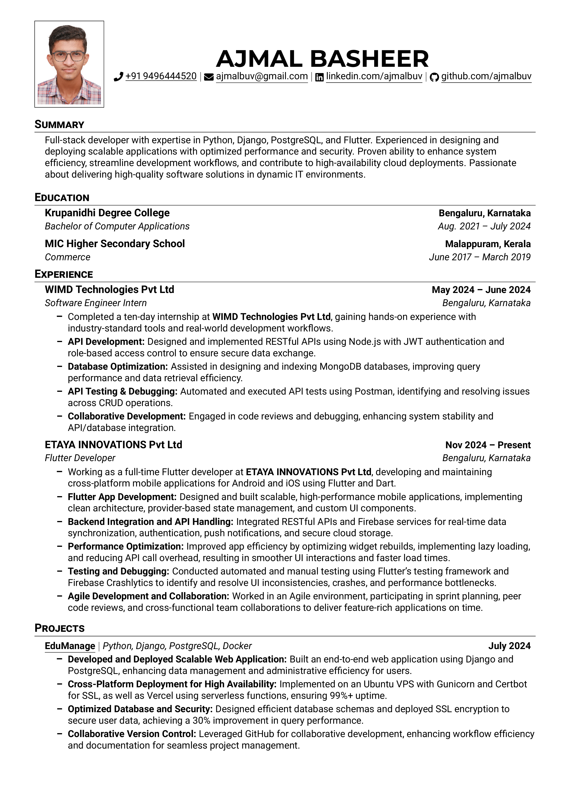
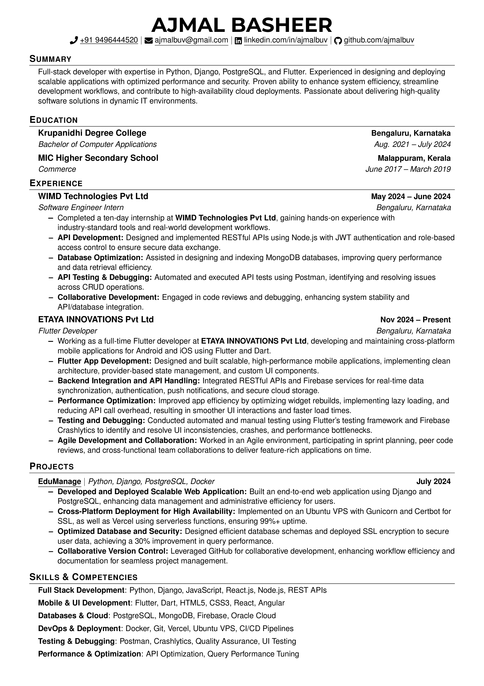

# resume

LaTeX template for my personal resume

Based off of [sb2nov/resume](https://github.com/sb2nov/resume/)

Use it on overleaf: [Jake's Resume](https://www.overleaf.com/latex/templates/jakes-resume/syzfjbzwjncs) (Not updated)

## Resume Preview

  
  

## Resume No Image

  
  

